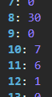
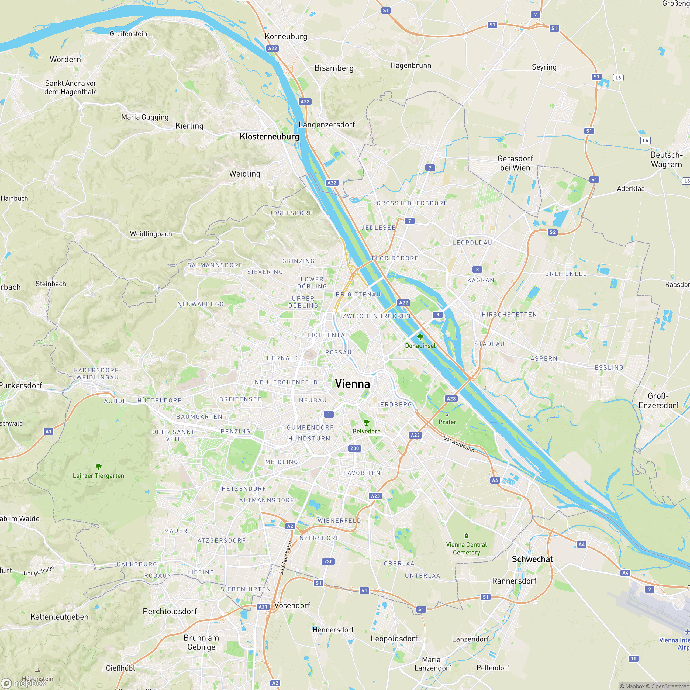
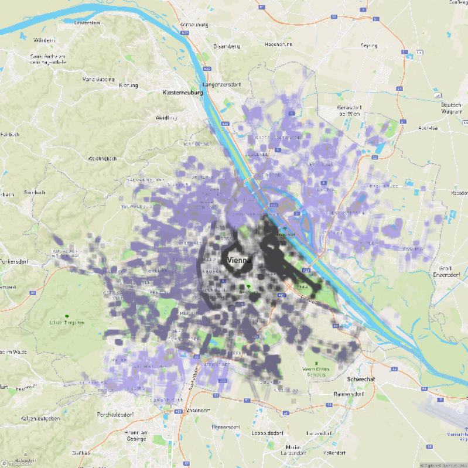
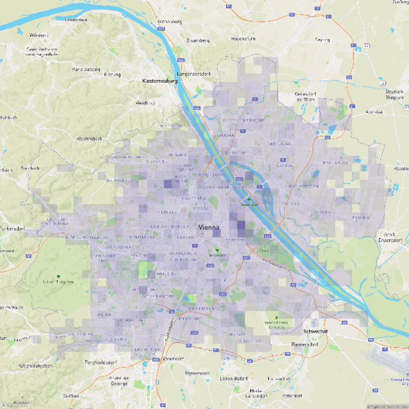

# Real Time Visualization WebGPU Tutorial

by Lucas Melo

- [Real Time Visualization WebGPU Tutorial](#real-time-visualization-webgpu-tutorial)
  - [Introduction](#introduction)
  - [Task 0 - Initialize WebGPU](#task-0---initialize-webgpu)
  - [Task 1 - Compute Shader Basics](#task-1---compute-shader-basics)
  - [Task 2 - Processing Real Data](#task-2---processing-real-data)
  - [Task 3 - Render an Image](#task-3---render-an-image)
  - [Task 4 - Render Trees as Markers](#task-4---render-trees-as-markers)
  - [Task 5 - Compute and Render Heatmap](#task-5---compute-and-render-heatmap)

## Introduction

**Welcome to the Real Time Visualization WebGPU Tutorial!**

This is a 90 minute tutorial. It consists of 5 tasks. By the end of it, you will have built your own neat little app to visualize the trees of Vienna.

WebGPU-capable browsers:
- Windows/Mac: Edge or Chrome
- Linux: Chromium
  - Install from here: [https://github.com/scheib/chromium-latest-linux](https://github.com/scheib/chromium-latest-linux)
  - Enable the flags listed here: [https://github.com/gpuweb/gpuweb/wiki/Implementation-Status#chromium-chrome-edge-etc](https://github.com/gpuweb/gpuweb/wiki/Implementation-Status#chromium-chrome-edge-etc)

First steps:
- Clone this repository (`git clone https://github.com/Welko/rtvis-webgpu-tutorial`)
- Open `index.html` on your favorite WebGPU-capable browser (no server needed). On Windows, your URL will look something like `file:///C:/Projects/rtvis-webgpu-tutorial/index.html`
- Open `tutorial.js` in your favorite IDE. All your code will go there.

## Task 0 - Initialize WebGPU

Duration: 5 minutes

Unlike WebGL, WebGPU **does not need a canvas**. It can be used only for its compute capabilites.

```javascript
async initializeWebGPU() {
    if (!this.gpu) {
        this.gpu = navigator.gpu;
        if (!this.gpu) {
            const message = "WebGPU is not supported in your browser. Please use/update Chrome or Edge.";
            alert(message);
            throw new Error(message);
        }
        console.log("Hooray! WebGPU is supported in your browser!");
    }
}
```


## Task 1 - Compute Shader Basics

Duration: 10 minutes

We start by creating a very simple shader that adds a constant value to all elements of a list.

To get access to your GPU device and communicate with it, get the `device`

```javascript
// WebGPU
gpu;
adapter;
device;

async initializeWebGPU() {
    ...
    this.adapter = await this.gpu.requestAdapter();
    this.device = await this.adapter.requestDevice();
}
```

Then, we upload some data to the GPU. For now, a fixed `[1, 2, 3, 4]` array is good enough.

```javascript
async initializeBuffers() {
    this.data = new Float32Array([1, 2, 3, 4]);
    this.buffer = this.device.createBuffer({ // Create GPU buffer
        size: this.data.byteLength,
        usage: GPUBufferUsage.STORAGE, // Storage buffers can be indexed directly on the GPU
        mappedAtCreation: true, // Enables us to write to the buffer immediately
    });
    new Float32Array(this.buffer.getMappedRange()).set(this.data); // Write to the buffer
    this.buffer.unmap(); // Unmap on the CPU so that the GPU can use it
}
```

This is the data that we want to process on the GPU through a compute shader.

Open the compute shader `shaders/add.js`. Note that this is a Javascript file. The shader code is written as a string and stored in the `window` object with the key `add`.

The programming language of WebGPU shaders is `wgsl`. If you are using Visual Studio Code, I recommend you install the extension [WGSL Literal](https://marketplace.visualstudio.com/items?itemName=ggsimm.wgsl-literal).

The first thing we'll add here is the **buffer binding**.

```wgsl
// At binding 0, we have a read-write storage buffer
@group(0) @binding(0) var<storage, read_write> data: array<f32>; // Array of 32-bit floats
```

Then we add our **compute entry point**.

```wgsl
@compute
@workgroup_size(64)
fn main(@builtin(global_invocation_id) globalId: vec3u) {
    if (globalId.x >= arrayLength(&data)) {
        return;
    }
    // Our computations will go here :)
}
```

In WebGPU, a **workgroup** is a fixed-size group of threads. In our entry point, we must specify the size of the workgroup running our code.

Because a workgroup is fixed-size, it is possible that more threads than data elements are being dispatched. To prevent undefined access to our data, we add an **out-of-bounds guard**.

```wgsl
// globalId.x is our thread ID
if (globalId.x >= arrayLength(&data)) {
    // Current thread is out of bounds. Do nothing.
    return;
}
```

Finally, we can use the thread ID to do something with the data. In this case, we just add a hard-coded value. The entire shader should then look like this:

```wgsl
@group(0) @binding(0) var<storage, read_write> data: array<f32>;

@compute
@workgroup_size(64)
fn main(@builtin(global_invocation_id) globalId: vec3u) {
    if (globalId.x >= arrayLength(&data)) {
        return;
    }
    data[globalId.x] += 100;
}
```

Now that our shader is done, we move back to `tutorial.js` and define the GPU pipeline that will run our shader.

```javascript
async initializePipelines() {
    this.pipeline = this.device.createComputePipeline({
        layout: "auto", // Bad practice. Good enough for a tutorial though
        compute: {
            module: this.device.createShaderModule({
                code: shader
            }),
            entryPoint: "main" // Name of the entry point function in the shader
        }
    });
}
```

Next, we must create a connection between our GPU buffer and a binding in the pipeline. Because we used `layout: "auto"`, the bindings are defined automatically for us. The **pipeline** bindings must match the **shader** bindings.

We create this connection via a **bind group** (a group of bindings).

```javascript
async initializeBindGroups() {
    this.bindGroup = this.device.createBindGroup({
        layout: this.pipeline.getBindGroupLayout(0), // Ideally created manually, but this is good enough for a tutorial
        entries: [
            { // Entry 0
                binding: 0, // Matches our shader!
                resource: {
                    buffer: this.buffer // Our data!
                }
            }
        ]
    });
}
```

There is last thing left before executing our pipeline. The pipeline with its bind group is executed through a **command**. Commands in WebGPU are encoded in batch, so that they can all be sent to the GPU at once. That is done via a **command encoder**.

```javascript
render() {
    const commandEncoder = this.device.createCommandEncoder();
    {
        const computePass = commandEncoder.beginComputePass();
        computePass.setPipeline(this.pipeline);
        computePass.setBindGroup(0, this.bindGroup);
        computePass.dispatchWorkgroups(1); // Only one workgroup! (64 threads, as defined in the shader)
        computePass.end();
    }
    const commandBuffer = commandEncoder.finish();
    this.device.queue.submit([commandBuffer]);
    console.log(await this.readBuffer(this.buffer, this.data.byteLength));
}
```

With our command buffer created, we can finally submit it to the GPU, and our shader code will be executed!

```javascript
render() {
    ...
    this.device.queue.submit([commandBuffer]);
}
```

The last step for this task is now to read the data back the CPU, where we can print it to the console.

However, we cannot read directly from our buffer. Our buffer was created with `usage: GPUBufferUsage.STORAGE`. To read from it, it must contain the usage flag `GPUBufferUsage.MAP_READ`. However, this usage flag cannot be used in combination with any other usage flags except for `GPUBufferUsage.COPY_DST`.

The solution: We must create a separate buffer to copy our data into.

In this part, we skip the details and encourage you to understand it in more detail on your own at another time.

```javascript
async readBuffer(gpuBuffer, outputArray) {
    // This buffer can be read on the CPU because of MAP_READ
    const readBuffer = this.device.createBuffer({
        size: outputArray.byteLength,
        usage: GPUBufferUsage.MAP_READ | GPUBufferUsage.COPY_DST
    });

    // Copy from 'buffer' to 'readBuffer'
    const commandEncoder = this.device.createCommandEncoder();
    commandEncoder.copyBufferToBuffer(gpuBuffer, 0, readBuffer, 0, outputArray.byteLength);
    this.device.queue.submit([commandEncoder.finish()]);

    // Map the GPU data to the CPU
    await readBuffer.mapAsync(GPUMapMode.READ);

    // Read the data.
    const resultData = new outputArray.constructor(readBuffer.getMappedRange());

    // Copy the data to the output array
    outputArray.set(resultData);

    // The read buffer is no longer needed
    readBuffer.destroy();

    return outputArray;
}
```

**Important!** In order for our buffer to be copied, it must contain the flag `GPUBufferUsage.COPY_SRC`. So now it will contain the following: `usage: GPUBufferUsage.STORAGE | GPUBufferUsage.COPY_SRC`.

The last thing left to do is print our data on the console!

```javascript
async render() {
    ...
    console.log(await this.readBuffer(this.buffer, new Float32Array(this.data.length)));
}
```

And we're done!


## Task 2 - Processing Real Data

Duration: 15 minutes

We start by loading some real data. The data we use here is from the [
Baumkataster bzw. Bäume Standorte Wien](https://www.data.gv.at/katalog/dataset/c91a4635-8b7d-43fe-9b27-d95dec8392a7), a dataset of trees in Vienna.

The data can be conveniently loaded with the provided `LOADER`. We may completely replace the old data and buffers with the new ones.

```javascript
// CPU Data
trees;

async initializeBuffers() {
    this.trees = await LOADER.loadTrees(); // Load 100 trees

    // TreeInfo
    this.buffer = this.device.createBuffer({
        size: this.trees.getInfoBuffer().byteLength,
        usage: GPUBufferUsage.STORAGE | GPUBufferUsage.COPY_SRC,
        mappedAtCreation: true,
    });
    // Attention! Now it's a Uint32Array, not float :)
    new Uint32Array(this.buffer.getMappedRange()).set(this.trees.getInfoBuffer()); // Write to the buffer
    this.buffer.unmap(); // Unmap on the CPU so that the GPU can use it
}
```

If we now refresh the page, you'll notice that the first 64 values of our buffer are at least 100, as expected.

Now we do something more interesting than that. Let us count the number of trees for each district in Vienna. For that, we write a new shader.

Open `shaders/aggregate.js`. 

Note that some things are already set up for you. Most importantly, our buffer bindings:

```wgsl
struct AggregatedValues {
    // Array of 23 atomic unsigned integers (one for each district in Vienna)
    districtNumberOccurrences: array<atomic<u32>, 23>,
};

// Our storage buffer at binding 0 now is of type TreeInfo (see the TreeInfo struct)
@group(0) @binding(0) var<storage, read> treeInfo: array<TreeInfo>;

// A second storage buffer is added, where our (atomic) counts are stored
// We need to create a new buffer for this!
@group(0) @binding(1) var<storage, read_write> aggregatedValues: AggregatedValues;
```

The only thing left to add is accessing the tree info for each tree and incrementing the count of its district.

```wgsl
let treeInfo: TreeInfo = treeInfo[globalId.x];

// Increment one to district number
let districtNumber = treeInfo.districtNumber;
atomicAdd(&aggregatedValues.districtNumberOccurrences[districtNumber - 1], 1);
```

Back to Javascript, creating the buffer that we will use for the aggregated values is simple, since we don't need to initialize its data (it is initialized with zeros).

```javascript
// GPU Data
gpuAggregatedValues;

async initializeBuffers() {
    ...
    this.gpuAggregatedValues = this.device.createBuffer({
        size: 23 * Uint32Array.BYTES_PER_ELEMENT, // 23 unsigned integers (one per district in Vienna)
        usage: GPUBufferUsage.STORAGE | GPUBufferUsage.COPY_SRC
    });
}
```

With a new **shader** and a new **buffer**, we must also create a new **pipeline** and a new **bind group**.

```javascript
// Pipelines
aggregatePipeline;

// Bind Groups
aggregateBindGroup;

async initializePipelines() {
    this.aggregatePipeline = this.device.createComputePipeline({
        layout: "auto",
        compute: {
            module: this.device.createShaderModule({ code: SHADERS.aggregate }),
            entryPoint: "main"
        }
    });
}

async initializeBindGroups() {
    this.aggregateBindGroup = this.device.createBindGroup({
        layout: this.aggregatePipeline.getBindGroupLayout(0),
        entries: [
            { binding: 0, resource: { buffer: this.gpuTreeInfo } },
            // Now we have a second buffer on binding 1!
            { binding: 1,  resource: { buffer: this.gpuAggregatedValues } }
        ]
    });
}
```

Almost done. Now we adjust the number of workgroups we're dispatching. Instead of just one, we calculate it based on how many trees we have.

Don't forget to also rename the pipeline and bind group we're using.

```javascript
const numTreeWorkgroups = Math.ceil(this.trees.getNumTrees() / 64); // 64 from shader

const computePass = commandEncoder.beginComputePass();
computePass.setPipeline(this.aggregatePipeline);
computePass.setBindGroup(0, this.aggregateBindGroup);
computePass.dispatchWorkgroups(numTreeWorkgroups);
computePass.end();
```

Finally, we can now print the contents of the aggregates buffer.

```javascript
console.log(await this.readBuffer(this.gpuAggregatedValues, new Uint32Array(23)));
```

You should now see displayed on the console the number of trees counted per district (note that we start at index 0). In the image below, district 9 has 30 trees, district 10 has 0, district 11 has 7, etc.



## Task 3 - Render an Image

Duration: 10 minutes


Finally we will render something on the screen. In this case, it will be just a simple texture.

The first step is to load our map data, which includes four images of Vienna: satellite, streets, outdoors, and height

```javascript
// CPU Data
map;

async initializeTextures() {
    this.map = await LOADER.loadMap(); // Load map images and geographical data
}
```

The images contained in map are ready to be used with WebGPU. So we can jump straight into creating our texture.

```javascript
// GPU Data
gpuMapTexture;

async initializeTextures() {
    ...
    const image = this.map.images.outdoors; // Try 'satellite' or 'streets' as well
    this.this.gpuMapTexture = this.device.createTexture({
        size: [image.width, image.height],
        format: "rgba8unorm",
        // TEXTURE_BINDING is needed to bind the texture to the pipeline
        // We also need to copy the image to the texture, so we need COPY_DST and RENDER_ATTACHMENT as well
        usage: GPUTextureUsage.COPY_DST | GPUTextureUsage.TEXTURE_BINDING  | GPUTextureUsage.RENDER_ATTACHMENT,
    });
    this.device.queue.copyExternalImageToTexture(
        {source: image, flipY: true}, // Source
        {texture: this.gpuTexture}, // Destination
        [image.width, image.height] // Size
    );
}
```

To finalize the initialization of our texture, we also create a sampler. It is through the sampler that we access the texture in the shaders.

```javascript
// Samplers
sampler;

async initializeTextures() {
    ...
    this.sampler = this.device.createSampler({
        magFilter: 'linear',
        minFilter: 'linear'
    });
}
```

With the texture data set up on the GPU, we begin the process of showing it on the screen. For this tutorial, we will write one vertex and one fragment shader, and we will render a quad (two triangles forming a rectangle).

For loading large 3D models, it can be beneficial to create a **vertex buffer**, which is used to feed data into our vertex shader.

Since we only render one quad (6 triangles with `triangle-list`), we hard-code the vertex and UV positions in the shader.

Open `shaders/image.js`.

This time, you will find only the definitions of our vertices and UVs.

We begin by adding our bindings.

```wgsl
@group(0) @binding(0) var texture: texture_2d<f32>;
@group(0) @binding(1) var linearSampler: sampler;
```

Next, we define the vertex shader. Other graphics APIs provide global variables to manage access to the inputs and outputs of shaders (e.g., OpenGL with `gl_VertexID` or `gl_FragColor`). In WebGPU, the inputs and outputs are explicitly defined and are available as arguments in our entry point function.

```wgsl
struct VertexInput {
    @builtin(vertex_index) vertexIndex: u32, // Analogous to gl_VertexID in OpenGL
};

struct VertexOutput {
    @builtin(position) position: vec4f, // Built-in vertex position output
    @location(0) uv: vec2f, // Varying passed to fragment shader
};

@vertex
fn vertex(input: VertexInput) -> VertexOutput {
    return VertexOutput(
        // Index our vertex/UV data using the current vertex's index
        // %6 just for safety in case the draw call has more than 6 vertices
        vec4f(VERTICES[input.vertexIndex % 6], 0, 1),
        UVS[input.vertexIndex % 6],
    );
}
```

In the fragment shader, we then use our sampler to sample the texture.

```wgsl
struct FragmentInput {
    @location(0) uv: vec2f, // Varying from vertex shader
};

struct FragmentOutput {
    @location(0) color: vec4f, // Built-in fragment color output (analogous to gl_FragColor)
};

@fragment
fn fragment(input : FragmentInput) -> FragmentOutput {
    return FragmentOutput(
        // Sample our texture
        textureSample(texture, linearSampler, input.uv),
    );
}
```

Like previously, we must still create a **pipeline** and **bind group**. Additionally, we also need to create a **color attachment**, which describes how the output of our render pass behaves.

First, for the pipeline:

```javascript
// Pipelines
imageRenderPipeline;

async initializePipelines() {
    const imageShaderModule = this.device.createShaderModule({ code: SHADERS.image });
    this.imageRenderPipeline = this.device.createRenderPipeline({
        layout: "auto",
        vertex: {
            module: imageShaderModule,
            entryPoint: "vertex",
            // buffers: We don't need any vertex buffer :)
        },
        fragment: {
            module: imageShaderModule,
            entryPoint: "fragment",
            targets: [
                {
                    // Only one render target, where our color will be drawn
                    format: this.gpu.getPreferredCanvasFormat()
                }
            ]
        },
    });
}
```

Then for the bind group:

```javascript
// Bind Groups
imageBindGroup

async initializeBindGroups() {
    this.imageBindGroup = this.device.createBindGroup({
        layout: this.imageRenderPipeline.getBindGroupLayout(0),
        entries: [
            { binding: 0, resource: this.gpuTexture.createView() },
            { binding: 1, resource: this.sampler },
        ]
    });
}
```

And lastly, the color attachment:

```javascript
// Attachments
colorAttachment;

async initializeAttachments() {
    // Calculate size of our image and set it to the canvas
    const minSide = -100 + Math.min(this.canvas.parentNode.clientWidth, this.canvas.parentNode.clientHeight);
    this.canvas.width = minSide;
    this.canvas.height = minSide;

    // Color attachment to draw to
    this.colorAttachment = {
        view: null, // Will be set in render(), i.e., every frame
        loadOp: "clear",
        clearValue: {r: 0, g: 0, b: 0, a: 0},
        storeOp: "store"
    };
}
```

There is one last step before rendering: setting up the HTML canvas. That is done analogously to WebGL (where we use `canvas.getContext("webgl)`), followed by a configurtion of the context:

```javascript
// WebGPU
context;

async initializeWebGPU() {
    ...
    this.context = this.canvas.getContext("webgpu");
    this.context.configure({
        device: this.device,
        format: this.gpu.getPreferredCanvasFormat()
    });
}
```

And finally, we can encode our commands into a buffer and submit it to the GPU!

```javascript
async render() {
    this.colorAttachment.view = this.context.getCurrentTexture().createView();

    const commandEncoder = this.device.createCommandEncoder();
    {
        const renderPass = commandEncoder.beginRenderPass({
            colorAttachments: [this.colorAttachment]
        });
        renderPass.setPipeline(this.imageRenderPipeline);
        renderPass.setBindGroup(0, this.imageBindGroup);
        renderPass.draw(6); // 6 vertices - one quad
        renderPass.end();
    }
    const commandBuffer = commandEncoder.finish();
    this.device.queue.submit([commandBuffer]);
}
```

And, finally, you should see a map of Vienna on your screen.



## Task 4 - Render Trees as Markers

Duration: 20 minutes



Finally, in this task, we will get to render our tree data. 

Previously, we had loaded the tree information. Now, in addition to that, we also load the coordinates of the trees.

```javascript
// GPU Data
gpuTreeCoordinates;

async initializeBuffers() {
    ...
    // TreeCoordinates
    this.gpuTreeCoodinates = this.device.createBuffer({
        size: this.trees.getCoordinatesLatLonBuffer().byteLength,
        usage: GPUBufferUsage.STORAGE,
        mappedAtCreation: true
    });
    new Float32Array(this.gpuTreeCoodinates.getMappedRange()).set(this.trees.getCoordinatesLatLonBuffer());
    this.gpuTreeCoodinates.unmap();
}
```

With this data now available, we move on to this task's shaders.

Open `shaders/markers.js`.

Our vertices and UVs are there again, together with the function `latLonToXY`, that converts latitude and longitude coordinates into XY coordinates in the range [0,1].

As you may have noticed, the function `latLonToXY` uses an object `u` that is not defined anywhere. This is our uniforms. Uniforms are not passed individually to a shader, but through an **uniform buffer**. We will define it now, together with our two other buffers.

```wgsl
struct TreeCoordinates {
    lat: f32,
    lon: f32,
};

struct TreeInfo {
    treeHeightCategory: u32,
    crownDiameterCategory: u32,
    districtNumber: u32,
    circumferenceAt1mInCm: u32,
};

struct Uniforms {
    mapWidth: f32,
    mapHeight: f32,
    mapLatitudeMin: f32,
    mapLatitudeMax: f32,
    mapLongitudeMin: f32,
    mapLongitudeMax: f32,
    markerSize: f32,
    unused: f32, // Padding
    markerColor: vec4f,
};

@group(0) @binding(0) var<storage, read> treeCoordinates: array<TreeCoordinates>;
@group(0) @binding(1) var<storage, read> treeInfo: array<TreeInfo>;
@group(0) @binding(2) var<uniform> u: Uniforms;
```

Our vertex shader will read from these buffers and use their information to decide where to place vertices and which color to use. Once again, we will not use vertex buffers here.

WebGPU, like other APIs, has **instanced rendering**. That allows us to draw one geometry several times with increased performance due to the reduced number of draw calls.

We will **NOT** use instanced rendering here. Instead, we go even more hardcore and derive the index of our (fake) instance based on its **vertex index**. Additionally to UV coordinates, we also pass a color to the fragment shader.

```wgsl
struct VertexInput {
    @builtin(vertex_index) vertexIndex: u32,
};

struct VertexOutput {
    @builtin(position) position: vec4f,
    @location(0) uv: vec2f,
    @location(1) color: vec4f,
};

@vertex
fn vertex(input: VertexInput) -> VertexOutput {
    // I'm so cool
    let treeIndex = input.vertexIndex / 6;

    // Get 2D position of tree
    let latLon = treeCoordinates[treeIndex];
    let xy = latLonToXY(latLon.lat, latLon.lon) * 2 - 1;

    // Calculate marker position and size
    let vertex = VERTICES[input.vertexIndex % 6] * u.markerSize + xy;

    // Get tree info
    let treeInfo = treeInfo[treeIndex];

    // Color based on tree district
    // THIS IS BAD VISUALIZATION
    // Ideally, the district number would be mapped into a qualitative color scheme
    // See colorbrewer2.org for some good ones
    let color23 = u.markerColor; // Color for Liesing
    let color1 = vec4f(0, 0, 0, color23.a); // Color for Innere Stadt
    let blendingFactor = f32(treeInfo.districtNumber - 1) / 22;
    let color = mix(color1, color23, blendingFactor);

    return VertexOutput(
        vec4f(vertex, 0, 1),
        UVS[input.vertexIndex % 6],
        color,
    );
}
```

And very little work is left for our fragment shader to do.

```wgsl
struct FragmentInput {
    @location(0) uv: vec2f,
    @location(1) color: vec4f,
};

struct FragmentOutput {
    @location(0) color: vec4f,
};

@fragment
fn fragment(input : FragmentInput) -> FragmentOutput {
    return FragmentOutput(
        input.color,
    );
}
```

And now, back to Javascript, we create the uniforms buffer.

```javascript
// Uniforms
uniforms = {
    markerSize: 0.01,
    markerColor: [255, 0, 0], // The screenshots use [117, 107, 177]
    markerAlpha: 0.01,
};

// GPU Data
gpuUniforms;

async initializeBuffers() {
    ...
    // Uniforms
    this.gpuUniforms = this.device.createBuffer({
        size: 1024, // Allocate 1024 bytes. Enough space for 256 floats/ints/uints (each is 4 bytes). That should be enough
        // UNIFORM (of course) and COPT_DST so that we can later write to it
        usage: GPUBufferUsage.UNIFORM | GPUBufferUsage.COPY_DST,
    });
    // Write to the uniforms buffer in render()
}
```

Note that we do not write into the uniforms buffer immediately. That is because its data may change very often. Because of that, we will write to it every frame.

```javascript
async render() {
    // Copy the uniforms to the GPU buffer
    // Warning: the layout must match the layout of the uniform buffer in the shader
    this.device.queue.writeBuffer(this.gpuUniforms, 0, new Float32Array([
        this.map.width,
        this.map.height,
        this.map.latitude.min,
        this.map.latitude.max,
        this.map.longitude.min,
        this.map.longitude.max,
        this.uniforms.markerSize,
        0, // Unused
        this.uniforms.markerColor[0] / 255,
        this.uniforms.markerColor[1] / 255,
        this.uniforms.markerColor[2] / 255,
        this.uniforms.markerAlpha,
    ]));
    ...
}
```

Now that we have all the buffers set up, we can proceed to creating our **pipeline** and **bind group** for the new shaders.

```javascript
// Pipelines
markerRenderPipeline;

// Bind Groups
markersBindGroup;

async initializePipelines() {
    ...
    const markersShaderModule = this.device.createShaderModule({ code: SHADERS.markers });
    this.markersRenderPipeline = this.device.createRenderPipeline({
        layout: "auto",
        vertex: {
            module: markersShaderModule,
            entryPoint: "vertex",
            // buffers: We don't need any vertex buffer :)
        },
        fragment: {
            module: markersShaderModule,
            entryPoint: "fragment",
            targets: [{
                format: this.gpu.getPreferredCanvasFormat()
            }]
        }
    });
}

async initializeBindGroups() {
    ...
    this.markersBindGroup = this.device.createBindGroup({
        layout: this.markersRenderPipeline.getBindGroupLayout(0),
        entries: [
            { binding: 0, resource: { buffer: this.gpuTreeCoodinates } },
            { binding: 1, resource: { buffer: this.gpuTreeInfo } },
            { binding: 2, resource: { buffer: this.gpuUniforms } },
        ]
    });
}
```

And now finally we can render the markers! We can render them immediately after the map, in the same render pass.

```javascript
async render() {
    ...
    const commandEncoder = this.device.createCommandEncoder();
    {
        const renderPass = commandEncoder.beginRenderPass({
            colorAttachments: [this.colorAttachment]
        });

        // Render map
        renderPass.setPipeline(this.imageRenderPipeline);
        renderPass.setBindGroup(0, this.imageBindGroup);
        renderPass.draw(6); // One quad

        // Render markers
        renderPass.setPipeline(this.markersRenderPipeline);
        renderPass.setBindGroup(0, this.markersBindGroup);
        renderPass.draw(6 * this.trees.getNumTrees()); // As many quads as we have trees

        renderPass.end();
    }
    const commandBuffer = commandEncoder.finish();
    this.device.queue.submit([commandBuffer]);
}
```

And, with that, you should be able to finally see the tree markers on the screen!

To load more trees, go back to where you load the date (`initializeBuffers()`) and pass a `true` to `loadTrees()`, like so:

```javascript
this.trees = await LOADER.loadTrees(true); // Load 219,378 trees
```

**BONUS 1/2!** Activate blending (i.e., transparency)

```javascript
async initializePipelines() {
    ...
    this.markersRenderPipeline = this.device.createRenderPipeline({
        ...
        fragment: {
            module: markersShaderModule,
            entryPoint: "fragment",
            targets: [{
                format: this.gpu.getPreferredCanvasFormat(),
                blend: { // This activates for blending!
                    color: {
                        operation: "add",
                        srcFactor: "src-alpha",
                        dstFactor: "one-minus-src-alpha",
                    },
                    alpha: {
                        operation: "add",
                        srcFactor: "src-alpha",
                        dstFactor: "one-minus-src-alpha",
                    }
                }
            }]
        }
    });
}
```

**BONUS 2/2!** Add UI controls

```javascript
async initializeGUI() {
    const onChange = () => this.render();
    [
        this.gui.add(this.uniforms, "markerSize", 0.001, 0.1, 0.001),
        this.gui.addColor(this.uniforms, "markerColor"),
        this.gui.add(this.uniforms, "markerAlpha", 0.01, 1, 0.01),
    ]
    .forEach((controller) => controller.onChange(onChange));
}
```

And so we're done! Your map should have markers, just like the one in the screenshot below.


## Task 5 - Compute and Render Heatmap




