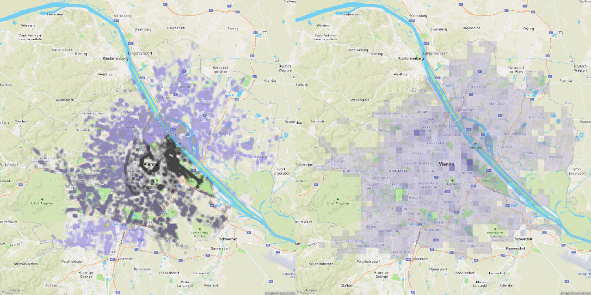
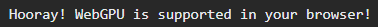
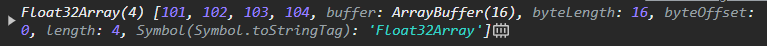

# Real Time Visualization WebGPU Tutorial

by Lucas Melo

**Welcome to the Real Time Visualization WebGPU Tutorial!**

This is a 90 minute tutorial. It consists of 5 tasks. By the end of it, you will have built your own neat little app to visualize the trees of Vienna.

WebGPU-capable browsers:
- Windows/Mac: Edge or Chrome
- Linux: Chromium
  - Install from here: [https://github.com/scheib/chromium-latest-linux](https://github.com/scheib/chromium-latest-linux)
  - Enable the flags listed here: [https://github.com/gpuweb/gpuweb/wiki/Implementation-Status#chromium-chrome-edge-etc](https://github.com/gpuweb/gpuweb/wiki/Implementation-Status#chromium-chrome-edge-etc)

First steps:
- Clone this repository (`git clone https://github.com/Welko/rtvis-webgpu-tutorial`)
- Open `index.html` on your favorite WebGPU-capable browser (no server needed). On Windows, your URL will look something like `file:///C:/Projects/rtvis-webgpu-tutorial/index.html`
- Open `tutorial.js` in your favorite IDE. All your code will go there.

## Task 0 - Initialize WebGPU

Duration: 5 minutes

Unlike WebGL, WebGPU **does not need a canvas**. It can be used only for its compute capabilites.

```javascript
async initializeWebGPU() {
    if (!this.gpu) {
        this.gpu = navigator.gpu;
        if (!this.gpu) {
            const message = "WebGPU is not supported in your browser. Please use/update Chrome or Edge.";
            alert(message);
            throw new Error(message);
        }
        console.log("Hooray! WebGPU is supported in your browser!");
    }
}
```



## Task 1 - Compute Shader Basics

Duration: 10 minutes

We start by creating a very simple shader that adds a constant value to all elements of a list.

To get access to your GPU device and communicate with it, get the `device`

```javascript
// WebGPU
gpu;
adapter;
device;

async initializeWebGPU() {
    ...
    this.adapter = await this.gpu.requestAdapter();
    this.device = await this.adapter.requestDevice();
}
```

Then, we upload some data to the GPU. For now, a fixed `[1, 2, 3, 4]` array is good enough.

```javascript
async initializeBuffers() {
    this.data = new Float32Array([1, 2, 3, 4]);
    this.buffer = this.device.createBuffer({ // Create GPU buffer
        size: this.data.byteLength,
        usage: GPUBufferUsage.STORAGE, // Storage buffers can be indexed directly on the GPU
        mappedAtCreation: true, // Enables us to write to the buffer immediately
    });
    new Float32Array(this.buffer.getMappedRange()).set(this.data); // Write to the buffer
    this.buffer.unmap(); // Unmap on the CPU so that the GPU can use it
}
```

This is the data that we want to process on the GPU through a compute shader.

Open the compute shader `shaders/add.js`. Note that this is a Javascript file. The shader code is written as a string and stored in the `window` object with the key `add`.

The programming language of WebGPU shaders is `wgsl`. If you are using Visual Studio Code, I recommend you install the extension [WGSL Literal](https://marketplace.visualstudio.com/items?itemName=ggsimm.wgsl-literal).

The first thing we'll add here is the **buffer binding**.

```wgsl
// At binding 0, we have a read-write storage buffer
@group(0) @binding(0) var<storage, read_write> data: array<f32>; // Array of 32-bit floats
```

Then we add our **compute entry point**.

```wgsl
@compute
@workgroup_size(64)
fn main(@builtin(global_invocation_id) globalId: vec3u) {
    if (globalId.x >= arrayLength(&data)) {
        return;
    }
    // Our computations will go here :)
}
```

In WebGPU, a **workgroup** is a fixed-size group of threads. In our entry point, we must specify the size of the workgroup running our code.

Because a workgroup is fixed-size, it is possible that more threads than data elements are being dispatched. To prevent undefined access to our data, we add an **out-of-bounds guard**.

```wgsl
// globalId.x is our thread ID
if (globalId.x >= arrayLength(&data)) {
    // Current thread is out of bounds. Do nothing.
    return;
}
```

Finally, we can use the thread ID to do something with the data. In this case, we just add a hard-coded value. The entire shader should then look like this:

```wgsl
@group(0) @binding(0) var<storage, read_write> data: array<f32>;

@compute
@workgroup_size(64)
fn main(@builtin(global_invocation_id) globalId: vec3u) {
    if (globalId.x >= arrayLength(&data)) {
        return;
    }
    data[globalId.x] += 100;
}
```

Now that our shader is done, we move back to `tutorial.js` and define the GPU pipeline that will run our shader.

```javascript
async initializePipelines() {
    this.pipeline = this.device.createComputePipeline({
        layout: "auto", // Bad practice. Good enough for a tutorial though
        compute: {
            module: this.device.createShaderModule({
                code: shader
            }),
            entryPoint: "main" // Name of the entry point function in the shader
        }
    });
}
```

Next, we must create a connection between our GPU buffer and a binding in the pipeline. Because we used `layout: "auto"`, the bindings are defined automatically for us. The **pipeline** bindings must match the **shader** bindings.

We create this connection via a **bind group** (a group of bindings).

```javascript
async initializeBindGroups() {
    this.bindGroup = this.device.createBindGroup({
        layout: this.pipeline.getBindGroupLayout(0), // Ideally created manually, but this is good enough for a tutorial
        entries: [
            { // Entry 0
                binding: 0, // Matches our shader!
                resource: {
                    buffer: this.buffer // Our data!
                }
            }
        ]
    });
}
```

There is last thing left before executing our pipeline. The pipeline with its bind group is executed through a **command**. Commands in WebGPU are encoded in batch, so that they can all be sent to the GPU at once. That is done via a **command encoder**.

```javascript
render() {
    const commandEncoder = this.device.createCommandEncoder();
    const computePass = commandEncoder.beginComputePass();
    computePass.setPipeline(this.pipeline);
    computePass.setBindGroup(0, this.bindGroup);
    computePass.dispatchWorkgroups(1);
    computePass.end();
    const commandBuffer = commandEncoder.finish();
}
```

With our command buffer created, we can finally submit it to the GPU, and our shader code will be executed!

```javascript
render() {
    ...
    this.device.queue.submit([commandBuffer]);
}
```

The last step for this task is now to read the data back the CPU, where we can print it to the console.

However, we cannot read directly from our buffer. Our buffer was created with `usage: GPUBufferUsage.STORAGE`. To read from it, it must contain the usage flag `GPUBufferUsage.MAP_READ`. However, this usage flag cannot be used in combination with any other usage flags except for `GPUBufferUsage.COPY_DST`.

The solution: We must create a separate buffer to copy our data into.

In this part, we skip the details and encourage you to understand it in more detail on your own at another time.

```javascript
async readBuffer(buffer, size) {
    // This buffer can be read on the CPU because of MAP_READ
    const readBuffer = this.device.createBuffer({
        size: size,
        usage: GPUBufferUsage.MAP_READ | GPUBufferUsage.COPY_DST
    });

    // Copy from 'buffer' to 'readBuffer'
    const commandEncoder = this.device.createCommandEncoder();
    commandEncoder.copyBufferToBuffer(buffer, 0, readBuffer, 0, size);
    this.device.queue.submit([commandEncoder.finish()]);

    // Map the GPU data to the CPU
    await readBuffer.mapAsync(GPUMapMode.READ);

    // Read the data. Use slice() to copy it so that we can destroy the buffer
    const resultData = new Float32Array(readBuffer.getMappedRange()).slice();

    // The read buffer is no longer needed
    readBuffer.destroy();

    return resultData;
}
```

**Important!** In order for our buffer to be copied, it must contain the flag `GPUBufferUsage.COPY_SRC`. So now it will contain the following: `usage: GPUBufferUsage.STORAGE | GPUBufferUsage.COPY_SRC`.

The last thing left to do is print our data on the console!

```javascript
async render() {
    ...
    console.log(await this.readBuffer(this.buffer, this.data.byteLength));
}
```

And we're done!

